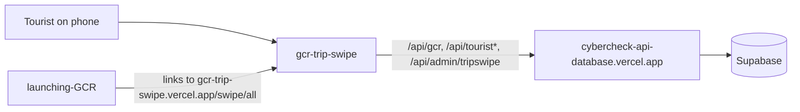

# gcr-trip-swipe

Trip Swipe: a phone-style React web app where tourists swipe on Gulf Coast businesses, save favourites, build an itinerary and share lists with a group.

## What it is

Only the screens. A visitor signs up, answers a few setup questions, swipes through businesses by category, saves the ones they like, has an itinerary built for them and can create or join a group. All data and logins come from a separate API server; this repo has no back end.

## How it works

- React 19 + Vite PWA (`react-router-dom`, `react-tinder-card`, `vite-plugin-pwa`). Entry `src/main.jsx`; routes in `src/App.jsx`: `/` landing, `/auth`, `/reset`, `/join`, `/privacy`, `/terms`, `/review/:slug`, `/setup/*`, `/home`, `/swipe/:category`, `/business/:slug`, `/list`, `/building`, `/itinerary`, `/profile`, `/groups`, `/group/:slug`. Most require sign-in.
- `src/config.js`: API host from `VITE_API_BASE`, default `https://cybercheck-api-database.vercel.app`; also reads `VITE_SUPABASE_URL` and `VITE_SUPABASE_KEY` (empty by default).
- API calls found in `src/`:
  - Business data: `/api/gcr` (entities, community-photos, swipe-item, track, locations/autocomplete).
  - Trip Swipe settings: `/api/admin/tripswipe/{settings,promo-cards,sponsored}` and `/api/admin/sms-config`.
  - Accounts: `/api/tourist-auth/{signup,signin,verify,phone,phone-verify,resend,forgot-password,reset-password}`.
  - Tourist state: `/api/tourist/{me,profile,preferences,setup-questions,swipes,seen,saves,itinerary,build-itinerary,super-likes,photos,location,sms-optin}` and `/api/tourist/groups`.
- `src/data/mockBusinesses.js` is used only for the category list. `src/services/supabaseAuth.js` imports `@supabase/supabase-js`, which is not in `package.json`, but nothing imports that file.
- `vercel.json` rewrites all paths to `index.html` (single-page app). The `test` scripts mention Playwright but no test files are in the repo.

## Run it

```bash
npm install
npm run dev        # Vite dev server
npm run build
```

Optional variables: `VITE_API_BASE`, `VITE_SUPABASE_URL`, `VITE_SUPABASE_KEY`. Sign-in, SMS and itinerary features need the API server (and its own configuration) to be up. Not run while writing this README.

## Status

In use: a fairly complete tourist app that acts as the front end for cybercheck-api-database's tourist endpoints.

## Where it fits



## Related repos

- cybercheck-api-database: the API it calls by default; mounts `/api/tourist`, `/api/tourist-auth`, `/api/tourist/groups` and `/api/admin`.
- launching-GCR: links here and rewrites `/trip-swipe/*` to another deployment (`trip-swipe-live-lgsh.vercel.app`), so other copies of this app exist.
